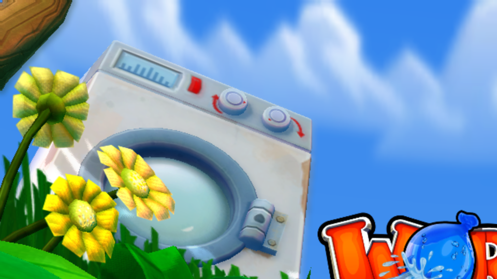

# Worms Revolution — native PC recompilation

**Team17's turn-based artillery classic, statically recompiled from Xbox 360
PowerPC to a native x86-64 executable.** No emulator, no interpreter, no JIT — the
original code is translated to C++ with the [ReXGlue SDK](https://github.com/rexglue/rexglue-sdk)
**v0.8.0** and linked against its runtime. It builds clean and boots into the
runtime; bring-up is in progress.

## Status: **playable** 🪱

Extraction → triage → codegen → build → bring-up, all in one sitting. `worms.exe`
links on the first try, boots crash-free, plays the full intro (Team17 → publisher
logos → cinematic, all full-motion video decoding natively), lands on the animated
title screen, and **runs actual gameplay** — the tutorial is playable end to end:
worms, terrain, weapons, physics, camera, and input all work.



*The title screen — washing machine, sunflowers, the `WORMS` logo, animated sky —
rendered by the recompiled game on D3D12. The intro logos and cinematic
(`images/team17_splash.png`, `images/intro_movie.png`) get you here.* See
[PROGRESS.md](PROGRESS.md) for the full blow-by-blow.

**One known gap:** in-game **text doesn't render** — speech bubbles appear but not
the words, menu buttons are blank. Worms draws its text/UI via *memexport* vertex
shaders (the GPU writes generated geometry back to memory), which this ReXGlue
build's D3D12 backend doesn't implement yet, so those draws are dropped. Everything
non-text renders and the game is fully playable; this is an SDK-side GPU feature,
not missing recompiled code (the whole reachable game needs **zero** functions
beyond the 444 already registered).

## How it got here

The whole pipeline — from a downloaded package to a rendering `.exe` — in one pass:

```
GoD package ──▶ STFS extract ──▶ XEX triage ──▶ rexglue init + codegen
              (170 files)      (base 0x82000000)  (PowerPC → C++, 88,816 fns)
      │
      └──▶ cmake/clang build ──▶ worms.exe (74 MB) ──▶ boot ──▶ runtime up
           ──▶ XEX loaded ──▶ 🎬 intro + cinematic ──▶ 🪱 title ──▶ 🎮 gameplay
```

Codegen and build were minutes of work. The craft was **runtime bring-up**:

- **Codegen hints.** The first codegen pass surfaced 13 `UnresolvedCall` tail-call
  targets sitting outside any discovered function. Registered all 13 as
  `[entrypoint.functions]` hints; second pass came back clean —
  **88,816 recompiled functions** across 110 translation units.
- **The link, pre-empted.** Rather than wait for the near-universal `XUsbcam*`
  link error (imported by ~26% of 360 titles, missing from the runtime exports),
  we dropped the toolkit's `stubs.cpp` in up front. Result: **linked on the first
  try**, no iteration.
- **The unregistered-function wall.** First boot came up fully and loaded the XEX,
  then FATAL'd on a call to `0x823D0608`. Cleared the whole class in two passes:
  (1) dumped the runtime-decompressed image via a one-shot `OnPostLoadXexImage`
  hook (`extract_pe.py` can't decode this LZX variant) and batch-registered **427**
  vtable/RTTI-referenced functions found by `find_missing_vtable_funcs.py`;
  (2) wired a tolerant indirect dispatcher to **harvest** the handful of
  `lis/addi`-computed targets that pointer scans can't see (just 3 on the boot
  path). **444 hints** total → boots crash-free.
- **Gameplay reached.** Drove title → menus → tutorial and played it: worms,
  destructible terrain, weapons, physics, and camera all render and respond. The
  tolerant-dispatch harvest logged **zero** unregistered targets across the whole
  session — the reachable game is functionally complete on the recompiled side.
- **The text gap.** The only missing piece is UI/in-game text (see status above):
  memexport vertex shaders aren't implemented in this SDK's D3D12 backend, so the
  4-vertex rectangle-list draws that emit glyphs get dropped. An SDK-side fix.

## Binary facts

| | |
|---|---|
| Title | Worms Revolution (Team17, 2012) — title ID `58411290` (dec `1480659600`) |
| Format | Games on Demand (STFS) + 3 DLC packs |
| Image base | `0x82000000` (standard) |
| Image size | `0x11E0000` (17.9 MB — a full retail disc title, ~2× a typical XBLA game) |
| Imports | `xam.xex`, `xboxkrnl.exe` (no XNET/Live import wall) |
| Recompiled functions | **88,816** |
| Executable | `worms.exe`, 74 MB |

## Build & run

You **bring your own** copy of the game — the package, extracted assets, and
recompiled C++ are all git-ignored. This repo tracks the project, not the game.
Prereqs: Clang 20+, CMake 3.25+, Ninja, VS2022, and a built ReXGlue SDK v0.8.0.

```bash
# 1. Extract your Games-on-Demand package (title 58411290) with the 360tools kit
python /path/to/360tools/tools/extract_stfs.py <GoD_PACKAGE> extracted/
#    flatten if STFS nested a dir:  mv extracted/extracted/* extracted/

# 2. Scaffold + regenerate the recompiled C++ (git-ignored, ~225 MB)
rexglue init --project-name worms --xex-path extracted/default.xex \
             --game-root extracted --project-root project
cd project && rexglue codegen      # re-apply the [entrypoint.functions] hints if fresh

# 3. Build
cmake --preset win-amd64-release "-DCMAKE_PREFIX_PATH=<rexglue-sdk>/out/install/win-amd64"
cmake --build out/build/win-amd64-release

# 4. Run
./out/build/win-amd64-release/worms.exe --game_data_root=../extracted
```

## Layout

```
project/
  worms_manifest.toml       # codegen config + 444 function-entry hints (the bring-up work)
  CMakeLists.txt            # sources + optional -DWORMS_HARVEST harvest build
  src/main.cpp              # ReXApp entry point
  src/worms_app.h           # app hooks (incl. one-shot REX_DUMP_IMAGE image dump)
  src/stubs.cpp             # kernel stubs (XUsbcam*)
  src/dispatch_tolerance.cpp # bring-up harvest scaffold (off by default)
  generated/default/        # codegen output — git-ignored, regenerable
images/                     # screenshots captured from the running port
extracted/                  # game data — bring your own (git-ignored)
```

## Credits

Built on the [ReXGlue SDK](https://github.com/rexglue/rexglue-sdk) (recompiler +
runtime, D3D12/Vulkan backends derived from [Xenia](https://github.com/xenia-project/xenia))
and the [360tools](https://github.com/sp00nznet/360tools) toolkit. Worms Revolution
and all game assets are © Team17 / the respective rights holders — this project
contains **none** of them. Every game recompiled is a game preserved.

## License

This project's own code (the ReXApp entry, stubs, manifest, and scripts) is
[MIT](LICENSE). It does **not** cover the game (bring your own) or the ReXGlue SDK
and its dependencies, which carry their own licenses.
